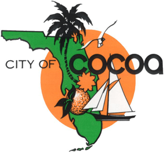
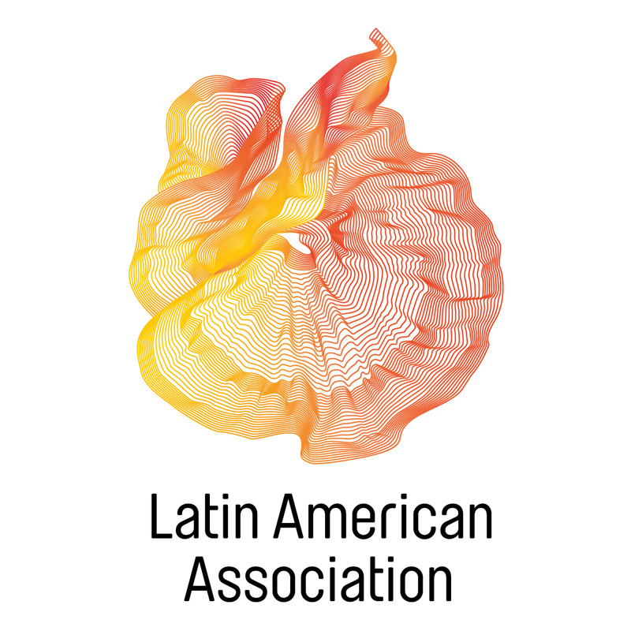
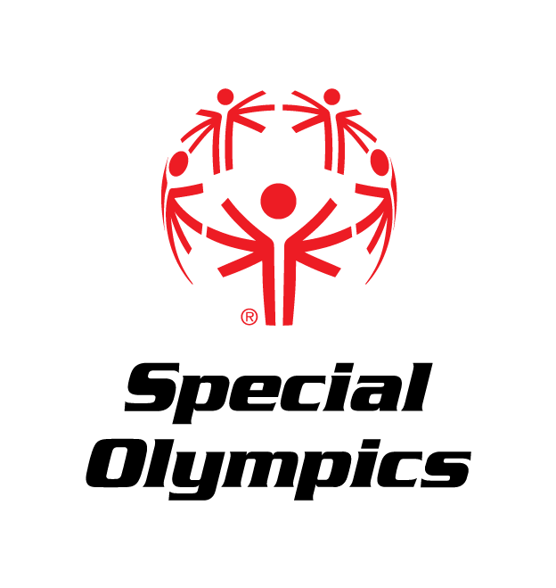

I am a Computer Science student at the University of Central Florida. I am interested in the field of Neuro-linguistic Programming, Machine Learning, and data analytics overall, so I have invested my time in exploring these fields. In my free time, I like to play video games, play a number musical instruments, and hang out with friends. I also enjoying playing and refereeing different sports, primarily soccer, dodgeball and ping-pong.

```
class David(person):
               major = "Computer Science"
               school = "University of Central Florida"
               graduationYear = 2018
               languages = ["English", "Spanish"]
               mainProgLanguages = ["Java", "Python"]
               favoriteSport = "Soccer"
               likesHackathons = True
```

#### I also enjoy volunteering

<div style='display:flex;flex-direction: row;flex-wrap: wrap;justify-content: space-evenly;align-items: center;align-content: flex-start;'>
    
    
    
    
    
</div>
