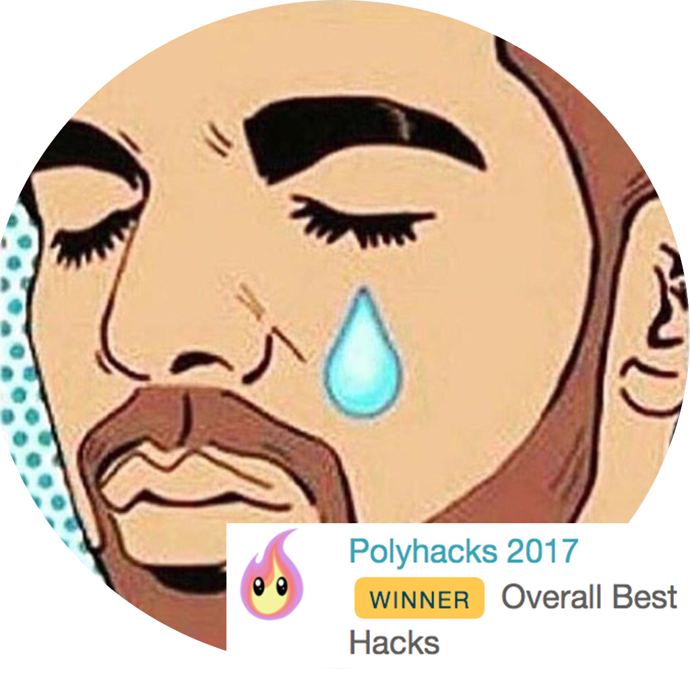
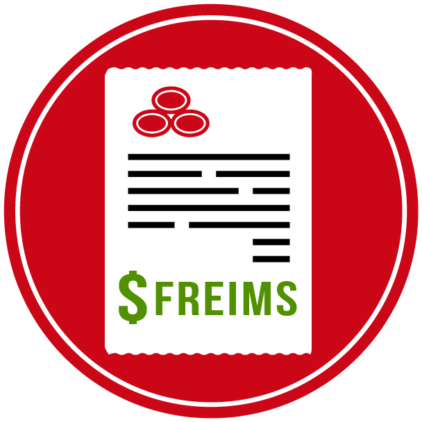

## AllTheFeels

Amazon's Alexa skill prompts the user how his/her day is going, then it curates a list of regularly-updated Spotify playlists tailored to the person's mood. Worked on incorporating the AlchemyAPI to the response from Alexa, then sorting a list of playlist in accordance to the sentiment in the person's day. Check the Devpost [here](https://devpost.com/software/allthefeels-9mdqs8)!

---

## SummarizeMe

Receives an article (or any body of text) and produces a summary around what sentences have the most value. Reduces big bodies of text to a 70-85% of it's original length. On the server side, the program is written in Python using the NLTK library, it's made into a RESTful API using Flask and deployed to AWS Elastic Beanstalk. On the client side, the application is written using Angular and deployed to GitHub Pages using angular-cli-ghpages. Project inspired by the auto TL;DR bot used in many subreddits. Check it [here](http://davidisrawi.me/SummarizeMe/)!

---

## Flavored News

Website scrapes news articles from multiple reliable prominent sources and categorizes such articles by mood/tone of the information. I developed the Watson® Tone Analyzer processor for the articles, a web scrapper for BBC news, and the website’s CSS using Materialize. Processor and web scrapper coded in Python. Check the [website](http://www.flavorednews.com) and [Devpost](https://devpost.com/software/lacodinggranja_2016)!

---

## SFreims

App eases the complexity of a web process to submit reimbursement forms for State Farm® employees. Developed with Ionic and AngularJS (Compatible with iOS and Android). I worked on the code for the ionic framework, and the basis for the AngularJS back end.
